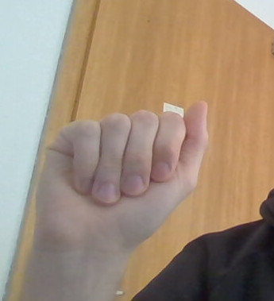
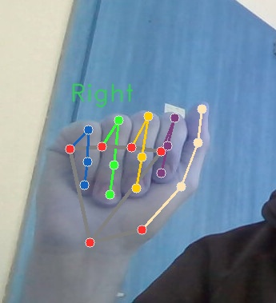

# mp-landmarks-to-csv

This project uses a [MediaPipe](https://ai.google.dev/edge/mediapipe/solutions/guide) landmark detection model to analyze the hands in a set of input images/videos.

For images, the extracted landmark coordinates are written into a `.csv` file along with the associated label. The label currently only supports a single letter from the alphabet which is provided by the first character of the filename.

For videos, the labels are stored in a `labels.csv` file inside the input folder. In addition, the landmark coordinates are aggregated over the length of the video and stored as mean and standard deviation for each coordinate.

At the moment we are using this script to get structured and labeled landmark data which is then used to train a tabular classification model.

## Installation

1. Create a virtual environment (optional):
    - `python3 -m venv .env`
    - `source .env/bin/activate`

2. Install dependencies:
    - `pip install -r requirements.txt`

## Preparing the input data

### Videos

> The script was only tested with .mp4 videos.

The videos should only contain data corresponding to a single label. The labels must be stored in a file named `labels.csv` alongside the videos in the input directory. `labels.csv` must contain two columns named `videos` containing the names of the video files and `word` containing the label for the given video.

### Images

> **Important:** Currently the script only works with **.jpg** images!

To extract the hand landmarks from an image, the hand should be fully visible. The filename **must** start with a letter specifying the label associated with the image or else the file will be skipped.

## Running the script

1. Put the images or videos you want to extract landmarks from into the `input` folder.

2. Navigate to the app folder and run the extraction script:
    - `cd app`
    - `python video_extractor.py` or `python image_extractor.py`

3. When using the image extractor, enter the name of the input directory and the name of the dataset you are creating. The latter will also be the name of the output directory.

MediaPipe will now analyze the images/videos and the script will save a `.csv` file to the output directory.

When extracting images, a copy of the images with an overlay displaying the analyzed points will be saved into the output directory.

When extracting videos, a window will open during extraction displaying the analyzed points. However, this will slow down the execution of the script, so when extracting larger amounts of videos the following lines should be removed from `video_extractor.py`:

```python
# cv2.imshow("Verification", annotated_image)
# cv2.waitKey(1)
```

## Example

### Videos

`1789715889624135-HELLO.mp4` is used as an input video and put into the input folder:


`labels.csv` is used to provide the label for the video and is put into to input folder:

| word  |           videos           |
| :---: | :------------------------: |
| hello | 1789715889624135-HELLO.mp4 |

The script processes the video and writes the following into the output directory:

`table.csv`:

| l_x_0_mean | l_x_0_std | l_y_0_mean | l_y_0_std | l_z_0_mean | l_z_0_std | ... | l_x_20_mean | l_x_20_std | l_y_20_mean | l_y_20_std | l_z_20_mean | l_z_20_std | r_x_0_mean | r_x_0_std | r_y_0_mean | r_y_0_std | r_z_0_mean | r_z_0_std | ... | r_x_20_mean | r_x_20_std | r_y_20_mean | r_y_20_std | r_z_20_mean | r_z_20_std | sign |
| :-: | :-: | :-: | :-: | :-: | :-: | :-: | :-: | :-: | :-: | :-: | :-: | :-: | :-: | :-: | :-: | :-: | :-: | :-: | :-: | :-: | :-: | :-: | :-: | :-: | :-: | :-: |
| -0.0255 | 0.0000 | 0.0647 | 0.0000 | 0.0485 | 0.0000 | ... | -0.0023 | 0.0000 | -0.0530 | 0.0000 | 0.0113 | 0.0000 | -0.0238 | 0.0146 | 0.0886 | 0.0036 | 0.0202 | 0.0229 | ... | -0.0102 | 0.0157 | -0.0377 | 0.0142 | -0.0517 | 0.0103 | hello |

The table contains the mean and standard deviation for each coordinate over the length of the video along with the label (sign) associated with the video.

### Images

`a.jpg` is used as an input image and put into the input folder:



The script processes it and writes the following into the specified output directory:

1. `[output].csv`:

    | 0_x | 0_y | 0_z | ... | 20_x | 20_y | 20_z | sign | hash |
    | :-: | :-: | :-: | :-: | :--: | :--: | :--: | :--: | :--: |
    | 0.3252 | 0.7996 | -0.0000 | ... | 0.3047 | 0.6118 | -0.0829 | a | 6.58763415117154e+018 |

2. `a.jpg`:

    

The table contains the coordinates of each landmark along with the label (sign) and hash of the image. The image with the overlay serves to validate the MediaPipe output.